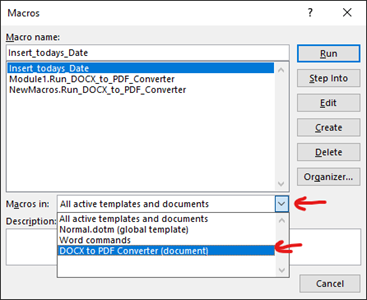
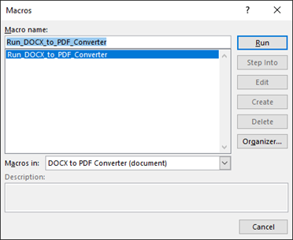
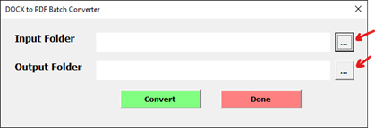
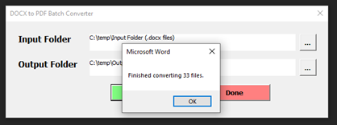

# Microsoft Word - DOCX to PDF converter

### Description:

-   Microsoft Word UserForm application for converting .docx files into .pdf files.

<!-- <a id="raw-url" href="https://fremen432.github.io/Password-Generator-JS/">Click to view Live Page </a>. -->
<!-- -   Windows desktop application built with Electron toolkit. <a id="raw-url" href="https://github.com/fremen432/Password-Generator-JS/releases/download/Password-Generator/Password-Generator-win32-x64.zip">Click to download </a>. -->

<!-- 

    

 -->

    

### Instructions:

1. Open the “DOCX to PDF Converter.docm” macro-enabled doc file found in releases.
2. To activate the macro, press Alt + F8 to open “Macros” Dialog box, make sure “DOCX to PDF Converter (document)” is selected in the “Macros in:” drop-down list.

    

 

3. Select the “Run_DOCX_to_PDF_Converter” macro, then click “Run” button.
    
From there, it will open the DOCX to PDF Batch Converter UserForm.

    

 

4. Use the “…” buttons to browse the file explorer for input and output folders.
    
The Input folder should be a folder containing “.docx” files that need to be converted.

    
The Output folder will be the destination where the converted “.pdf” files will be saved.

    

 

5. Once Input folder and Output folders are selected, click “Convert” button to run the batch conversion process.
When conversion process is complete, a confirmation message box will appear, indicating that the process is finished.

    

 

6. Once finished, you can choose to select a different Input and Output folder for a new conversion process or select “Done” button or “X” to close the User Form.